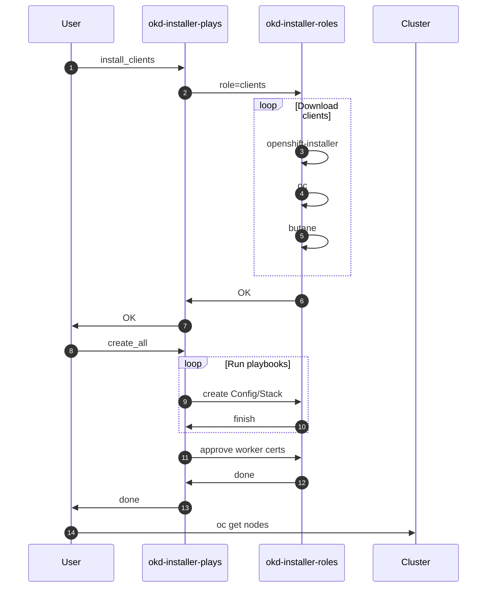

# Dev Guide - Creating Diagrams

!!! warning "Oops... TODO / WIP page"
    This page is not completed!

There are a few options to provide diagrams to this documentation:

- Migrammer
- Mermaid
- Images (static)
- Draw.io / Diagrams.net

!!! danger "Attention"
    We will not store images directly to the source code.

    The steps below will share how you can embed diagrams to the guides/documentation without needing to add images to the CVS.

## Migrammer

The [migrammer](https://diagrams.mingrammer.com/) allows you to create Diagram as a Code. The `mkdocs` on this project will auto-build python diagrams to allow you to reference the images to the documentation.

To create an standard of diagrams, all the python files must be under the directory `docs/diagrams/`, and all the images generated by the diagrams should be under `docs/diagrams/images` - ignored by github.

An example diagram is provided on `docs/diagrams/example.diagram.py` and the image will be generated on `docs/diagrams/images/example.png`.

- Code: 
- Referencing the image

## Mermaid

You also can add [Mermaid charts](https://mermaid.js.org/) directly on the markdowns.

A short example of the flow:

## Images (static)

Static images can be added to the documentatoin by uploading it to the Wiki Page with the prefix `image/`, then the URL can be referenced on the docs.

## Draw.io / Diagrams.net

You can embed the Diagram from Diagrams.net directly to the markdown file by following the option: `File > Embed > Html...`

<div class="mxgraph" style="max-width:100%;border:1px solid transparent;" data-mxgraph="{&quot;highlight&quot;:&quot;#0000ff&quot;,&quot;lightbox&quot;:false,&quot;nav&quot;:true,&quot;resize&quot;:true,&quot;toolbar&quot;:&quot;zoom&quot;,&quot;edit&quot;:&quot;_blank&quot;,&quot;xml&quot;:&quot;&lt;mxfile host=\&quot;app.diagrams.net\&quot; modified=\&quot;2023-03-26T02:00:26.997Z\&quot; agent=\&quot;5.0 (X11; Linux x86_64) AppleWebKit/537.36 (KHTML, like Gecko) Chrome/109.0.0.0 Safari/537.36\&quot; etag=\&quot;WQW_yDxS6ll7vZ8CMpN0\&quot; version=\&quot;16.2.4\&quot;&gt;&lt;diagram id=\&quot;C5RBs43oDa-KdzZeNtuy\&quot; name=\&quot;project-overview\&quot;&gt;7V1tc9s2Ev41miY3Iw0Bvn/0S5LLJW189aVp74uHImGLNUWoJGVb/XC//QASlEhiJdIWX2QmbmYqggQk7u6zWOwuFhP1Yvn0IXJWi5+pR4IJVryniXo5wRhpGE/4P8XbZC0qUo2s5S7yPfHUruHa/5uIRkW0rn2PxKUHE0qDxF+VG10ahsRNSm1OFNHH8mO3NCh/68q5I1LDtesEcus330sWotXQtd2NfxL/bpF/NTLs7M7SyZ8WrxIvHI8+FprUdxP1IqI0yT4tny5IwMmXE+bbx8234PO98eFf/47/cr6ef/rPL79Ns8HeP6fL9h0iEiYvHvqX1X//fPft4Ya+1+hvv1z/TbyL5dRWs7EfnGBNym+bbHIaRnQdeoQPo0zU88eFn5DrlePyu49MbFjbIlkG7Aqxj54TL9Jn+cWtHwQXNKARuw5pyHqcN3wX8c4PJErIU4GV4t0+ELokSbRhj+R3kW7OFCGcQlqnyDbF6zzumI8N0bYo8l0RjY4QuLvtN+xoyj4Isj6DxBaSSNwthfn9KydJSBSmD2FF65DuqqlLZGetMtlVTZvZGkB5rSvK56rqe6K8YsmUN1VA4FW7K7KjvgW+MwLbEIE1mcA6ggiMO9MoI6GvrXH6Kts/VCU1oLy32qJEar0rUhuGRFriMQNDXNIoWdA7GjrBu13reZn4u2c+U7oSVP6TJMlGWEvOOqFlhjyP4DFdRy458BKCOIkT3ZHkEHDFy/I3PMi/iARO4j+UTSyI9mnXsyhyNoUHVtQPk7gw8hVv2ImFjmTYIQtVrJtKJ81QajuxD9lv2cnD9qWOEBFzCBFhkhFtfuf9Z3p++YcYLr24fCpdbcTVUKKlv17R0s3BRMsaWLQ0vSxcM0WxagQsvboikc9enkQvkrqWhaShFFTN0Ez2RdcD4mEY1sxUNTv/MysDm5Y9yxmZj53hRRq7F3E2DHsocbZ/aMp6Tam+Xk1pDjYJm7LX4odoSaKFX69oWYfXCv1ImaUPK2XluVivkbJbGiZiUDSk1J2G0KmA0Nm4B6ERdCqs1t2IOAm5cYN1zE2k/Wt3VL92LzKZvfv5XeDEsRCAOIno/dbtzZ/eurCfLw/Nl/WaAeEb8EshyG3SmTfwVWG3ZazmkZc6rLY+QRznSJSRQ8Nb/26CjYC9xfmcYce4S1JyGc6SIyOcx6vsOn2Co6PEc+OvNc1vTOOUa2fsAaSsnnY381Hf/I/97JkTxv6cdcfv6b039cM4cYKAw/a9AHDM39I8F1c3obMkE/Pybf4b2N3sZ+Q/dWRwNzRIs0JxFxX1CPeBvTKDwh03hHvrS42jOKbZEt4dN/FpCHLyszMnQZn6TuDf8cCLy6jIXQ/nXIh91wnOxI2l73kZownDvjNPx+P0F9YDG1w/n+iXIEcOSZmElm1AW3zJpBgyhlCkzLClCC/Bke6NqVYBYwVi9PY2JonErhZMHbxXYY9M59nG4dWIna8UCurPUmXtZ3al/eSwfsaJm1VEH3xvhFYnYibmTLGrjDDwTGYFm57AUDTWu7JkBnFPtDyrGA1nFfukZhU5B0CYcGz95ROxZhwVEkwdClsDGRkI97n+0gYOZgxqkdkNsaOdRggWIQzJUI2Pbk8vrQcniy2bHgLmQxiP9Z63gwg53pqcKjMVKeVIFDrOuOzeepTN/7Fq6BrzEVTWVp+62hjYWTazLLuor5k8KwjVqOwWIs/1jrTGS+vTSHioC5sYRk2wWFVl506lUzcaHckanelz9/7Gd5ajUwiWAvjQTHtoLaANrQXsavqJqp6CElBflxIAw/L1yAdEsh/ky86LDPleOD5TwARMZhD5Zq/IVwdHPpqc5PyvvS7oG2b9/H1Kk762B/ohSR5pdD86+BsqoJrBiV/vE/54cPirk1Oc+PXXhX4wc7ke/dpQ6Nf3oD+gjjd3Aid0Rxi4ANPhIBXQb7qMgSRKD2r8T09GCTSNg5yIEgB3xpyw9S8HbDIl4NLlap2Q0eFfa4p/u0/4m8OaABztSsUGUG18CvA3G8Iftw7/40LQearKDlce4SK/GW0iqqnjmd4oEbXXQGhefmCwmVU1S8jiWNNOAVlWU2Rpp4WssezHhgoKIAOIRelQQYHu6glAgUG69qZjjASoFgZ4oADWgNGjysr1o8SCMbpkNYvBQLd3f3oTdvQ5g+SqTGLHWN1kuoUaoqJXNuA9bBjrUsW0Icfw4GwAkl1TNozabWSYQLkriBf9uo3sod1GqmlUjdvnbpQkT36SD6aJaz4WyoNQ7Ho3FL/YFC6qVnIfpjNuHJYSfD8R0xnL8Z4DQD1l09kA0KgBuwDgWlxd5Z3rsmq8zBb98h66X0kmZrJB1weABeRQAW4iSXcv2NrGUFN/zXbHDlO3gr5H7tixgUJjTHqM8jgtFQ1BCNx/r9Tl9kK9DEG0fb3AF6t0KruR+0w4xXK8ycvRMTJrwdZryifgob1i5sCGQ9nX3PeGzaYxJWy2PX+3l1Zi2YdViK3WyOCx/fUewlNYDk/R+GbpRxEd4RoDSk4DHeiKOeszQUUfOj9dTk/TTiE2jRsHp1p3ob/QFgElTK+zRaBeek1IGykq4ER6Wa/cNutU1eiyqkEzdv11xR0bsgH/5Zrd/LjkBdGle5h3vEjrzsg3RR8AUKexyT5Heyv7ohQ731lw7Db7XA9utlJZHqJDw1WO5Y53Eqo1XaEqwb2arlgOUG1BVqhQkzas84ar7UZ85SyvMKMsqbcO+Apc4b+Ii3cQEFEDY1tNZl0dk7XN95aXYVROyjzO+FhxjAC+kuZIh4SqPNuW/DJdSYqmVCM1kAcGgx6YzvyhDTxcPZguz3BxHna6QB7Olo2Y9n2UexYxmlIRF6lk+x6XS1t6PH/Tcbo/VWgXCwS+7g6AkOOkzRXzT1wNX/BAEvv/9eWnrVI+u/r4Qxu/RBurkDYGj07oTCDwqAGHG8YbtK7iDaocb3gh4ArRiB9Qa3RQyaGMFUgyekae7Gv/QEJmSLhsuHdP/MgcJyjZwr/SzBJ+IwowTiPWMJ2Y56LA4nfN8KaZemAmRndMltelEtolfbDj+EVhtaNUim1CgIcUgyK7N958DG8jh8sWM4uXjhg/m8u/Xn18+z0Lkqbps9xvsSs/Aq6arJll9SlLclYtXZEwXvi3SVEwRubtQNiCjrFDMkfAvJ7u2AEU54xjP06IN2ZuIMjOGp4bmmzHfhfggNiBlTwmV8eOzg5k02Szl7rfC/V1wP3aL/VlF5vrUjeRS7+NlANmQ3XUHQdk436+TpxwfBnQ4PR8Chzo+6jT7kQcOMYXK4ArsedjfDV5bVNzPMDclyuXn+DSot9Da2H+Iij9TO/Tosq/rMDeq8DZzCm9lxNiT5CLXfFLBw8ZBs7AhepTdcct2bG/dRf5YeZM+q7X9S85WrdXV5EuG23rPXktDIMJYxQjpXSLEd/f+nOqNxOasp9GYEbMm/navSeJLCU9ZrvzqmbqpJjxbm+v94RfC/VRFKlEqvmiEmk9hHR1YY20l5e2S+hhMtrOuRlIgbyqVp7j/9xzQZFiGEDmWPXIh5ay+u10Wt2fJaOXjzoD+lud9tcss6IzBkr6z0WxuFbZKZiRLVfqcqfMwXOnzMFPz1bMqho9iTJT+ZKyVmWa3RwZICEcQ3uwrWrVhz3qTB4NOKRiex5jna59fh08WRNjZPawXcB8VYdeFOwSe1JKCkPWYbOkexPCQg3x0E322LOrrmG5iiJWLPsgKDTw/IwXdEJWH6XaLNkl8tMQ4t7xQbdm042hRypY+NxUxe7EXlSBUxsxqtkMAXXa/sJuRU2OBkdrvuyL/fAuTR6QV3gr4b9J5ZFXEPwHKJyneRaM1ebJgqZVTggSA71UXnPW5zUCuzfaTTnA8DVOc+dFSqa39HdJHbIoXKzjhP2IXYcrJ0rCXV5J8SRZfvt87QfQIXnMaF/xj+tlcOYmtCgaqRhd0TjzR6iXc5qwrwRkJ6GVdQNdJ4EfkouMrZPGLtoevfIaUA6USZa8eICyDY3O1g5y0MNNGS2ztXrk9n5dMbIVIFRdGCPAfwsu+/SuWJfvnQJYx9qiGPDX+SKLy+FeXifVgx6R3XevnmGmvMwCobYNdfWyTrdkt0l9ap/Q0YETelvN++UT66tckoeimm2a3Vfh9Xfk0Oc1OysyAZ3oaNiyTLThw7//eUndm03wObnePHz+/Dv5FDlTGcMH0Ngg5lzk0wSrt5ZLXFdiKrszt3RN7xKEODdtdv5LKLkWCkC3oTJBakN7WVqktucQ6xaktuFaZH7bJbWNKrV1KF8dojZqYScDSG1I3R1D7f4k1QAmd5B2nekFaBNIm5KqE8vTIEm18Fw1jD4lFStANQzQgd6ZXmi7hFqF2gQxepsQtW3DVJ1OqV2VbV4sv5lsWwdWs0dRW15y5DuWrvadrF5npRQntH1TYJv2SlfsQpWCCFOkNswy6AwbsoNS5hb7br5v5Go9D/hmJOXNlxUJr1On4PNTSIrT5b4J9lXw0qjyUm+6BKkGuFtjpuwCvKDLpR/6yeZYtvWzUOiMWXaVWQaSmQUdHdoZ8OTdItm6rzWOFWf7ffbBq+CdWeUdVF8LUpptuNXghYa8rrv8+MdLOLS1EPbZFK+BQ1jaH4dseXUCJSN3ZmCj/XUNuEerxCfjrzXNb0zj1Nd1xh5A+uopc7OI+8/bjqm8WUX0T+6uZrcYLR988vgW8qZvvTjZDztpR07qDRQ/Su9KnHi4VpIoFch/Vk17llePOVKquB/uy1ywK8jiXUWh2XrYFkmyilMBec/+3fnJYj2fudwr+36ZrAOfsg/5duxdbaLpvr26Fc9d4If32Re38z24Fie4wAoBLFnqBlq5a7pxcNP+TusXhaKl+inssiAUz1E98uL+y2NIonjhr1KG1iK7VcRWlks6/08gudCe/YHGevrX5fyuVLkKuGcg08x+GVcjSpNi7JVRbfEz9Tji3/0f&lt;/diagram&gt;&lt;/mxfile&gt;&quot;}">

